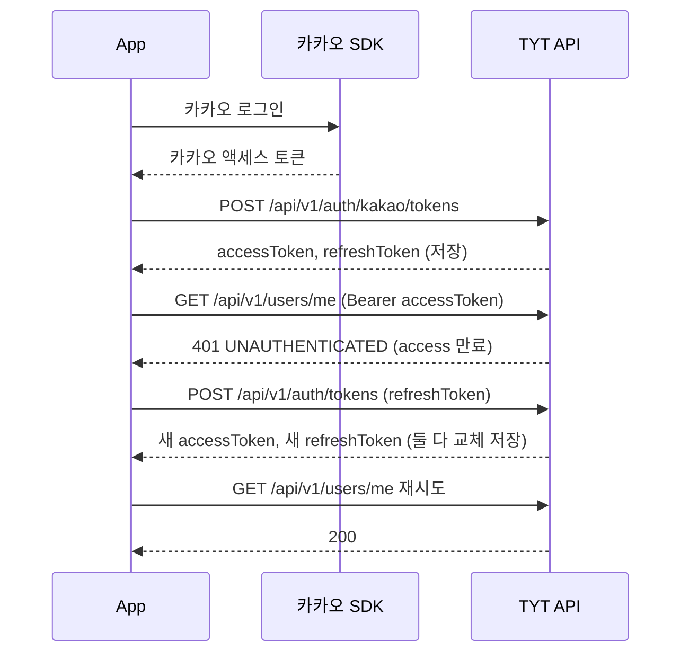

# TYT API 가이드

이 문서와 [`openapi.yaml`](openapi.yaml)만 보고 화면을 만들 수 있게 하는 게 목표다.

- **엔드포인트별 요청·응답·에러 코드**: `openapi.yaml`. 코드에서 생성하고, 코드와 다르면 서버 빌드가 실패하므로 항상 최신이다.
- **여러 호출에 걸친 흐름과 공통 규칙**: 이 문서. OpenAPI로는 표현할 수 없는 것만 적는다.

## 스펙 보는 법

- 파일: `docs/openapi.yaml`. tyt-fe에서는 `../tyt-be/docs/openapi.yaml`
- 로컬 서버를 띄웠다면 `http://localhost:8080/swagger-ui.html`에서 직접 호출해볼 수 있다. 오른쪽 위 Authorize에 accessToken을 넣는다.
- 운영 서버에서는 swagger-ui와 스펙 경로를 열지 않는다.

## 공통 규칙

### 경로

모든 API는 `/api/v1`으로 시작한다.

### 응답 봉투

성공이든 실패든 같은 형태로 온다.

```json
{ "code": "LOGIN_SUCCESS", "message": "로그인했습니다.", "data": { } }
{ "code": "INVALID_REFRESH_TOKEN", "message": "refresh 토큰이 유효하지 않습니다. 다시 로그인해야 합니다.", "data": null }
```

- 성공·실패는 **HTTP 상태 코드**로 판단한다. 봉투에 성공 여부 필드는 없다.
- 화면 분기는 **`code`** 로 한다. enum 이름이라 바뀌지 않는다.
- `message`는 표시·디버깅용이다. 문구가 바뀔 수 있고, 요청 형식 오류의 메시지는 서버 로케일에 따라 달라진다. 분기에 쓰지 않는다.
- 실패하면 `data`는 항상 `null`이다.

### 모든 API에서 날 수 있는 에러

| 상태 | code | 언제 |
| --- | --- | --- |
| 400 | `INVALID_REQUEST` | 필수값 누락, 잘못된 JSON 등 요청 형식 오류 |
| 404·405·415 등 | `INVALID_REQUEST` | 없는 경로, 지원하지 않는 메서드나 Content-Type. 상태 코드는 원래 값 그대로다 |
| 401 | `UNAUTHENTICATED` | 인증이 필요한 API에 토큰이 없거나 만료·무효 |
| 500 | `INTERNAL_ERROR` | 서버 오류 |

엔드포인트마다 추가로 나는 에러는 `openapi.yaml`의 응답 코드별 설명에 있다.

### 날짜·시간

`2026-09-14T00:00:00`처럼 **오프셋 없는 ISO-8601** 이고, 모두 **한국 시간(Asia/Seoul, UTC+9)** 이다. 기기의 시간대와 상관없이 한국 시간으로 해석한다.

## 카카오 앱 설정

앱과 서버는 **같은 카카오 Developers 앱**을 써야 한다. 서버는 로그인 요청의 카카오 토큰이 서버에 설정된 카카오 앱(`KAKAO_APP_ID`)에서 발급됐는지 검사하고, 다르면 `401 INVALID_SOCIAL_TOKEN`을 돌려준다.

- 앱의 카카오 SDK에는 그 카카오 앱의 **네이티브 앱 키**를 넣는다. REST API 키나 어드민 키가 아니다. 어드민 키는 서버에만 둔다.
- 카카오 Developers 콘솔에서 그 앱에 플랫폼을 등록한다. iOS는 번들 ID, Android는 패키지명과 키 해시다. 개발용과 배포용 서명 키가 다르면 키 해시를 둘 다 등록한다.
- 서버는 카카오 회원번호만 쓰고 프로필·이메일 같은 사용자 정보를 요청하지 않는다. 서버를 위해 설정할 동의 항목은 없다.
- 키 값과 앱 ID는 채팅이나 저장소에 올리지 않는다.

## 인증

### 토큰

| | 유효기간 | 쓰는 곳 | 규칙 |
| --- | --- | --- | --- |
| accessToken | 30분 | 인증이 필요한 모든 API의 `Authorization: Bearer <accessToken>` | |
| refreshToken | 14일 | `POST /api/v1/auth/tokens`에만 | 사용자당 하나만 유효하다. 다른 기기에서 로그인하면 이전 기기의 refreshToken은 무효가 된다. 재발급하면 새 값으로 바뀌고 이전 값은 바로 무효다. 로그아웃·탈퇴하면 서버에서 지워진다 |

두 토큰 모두 기기의 안전한 저장소(iOS Keychain, Android Keystore 기반 암호화 저장소)에 저장한다.

토큰 없이 호출하는 API는 로그인(`POST /api/v1/auth/kakao/tokens`)과 재발급(`POST /api/v1/auth/tokens`) 두 개뿐이다. `openapi.yaml`에서 `security: []`로 표시된다. 로그아웃과 탈퇴는 같은 `/api/v1/auth` 아래에 있지만 토큰이 필요하다.

### 흐름



### 401을 받았을 때

1. 인증이 필요한 API가 `401 UNAUTHENTICATED`를 주면 재발급을 **한 번** 시도한다.
2. **재발급 요청은 한 번에 하나만 보낸다.** 재발급이 진행 중이면 다른 요청은 기다렸다가 새 토큰으로 다시 보낸다. 같은 refreshToken으로 두 번 보내면 뒤 요청은 이미 교체된 토큰이라 `401 INVALID_REFRESH_TOKEN`을 받고, 멀쩡한 사용자가 로그아웃된다.
3. 재발급에 성공하면 **두 토큰을 모두** 교체 저장하고 원래 요청을 한 번 다시 보낸다. 그래도 401이면 로그인 화면으로 보낸다.
4. 재발급이 `401 INVALID_REFRESH_TOKEN`이면 저장된 토큰을 지우고 로그인 화면으로 보낸다.
5. 로그인이 `401 INVALID_SOCIAL_TOKEN`이면 카카오 로그인부터 다시 한다.

### 로그아웃

1. `DELETE /api/v1/auth/tokens`를 access 토큰으로 호출한다. 서버에 남은 refresh 토큰이 지워져, 유출됐더라도 더 이상 재발급받을 수 없다.
2. 응답과 상관없이 기기의 두 토큰을 지우고 로그인 화면으로 보낸다. 401이면 access가 만료된 것이라 재발급 후 다시 호출해도 되지만, 실패해도 사용자는 로그아웃시킨다.
3. access 토큰은 서명만 확인하므로 로그아웃 뒤에도 만료(최대 30분)까지 유효하다. 기기에서 지웠으므로 쓰이지 않는다.
4. 카카오 SDK의 로그아웃은 서버와 무관하다. 앱에서 필요하면 호출한다.

### 탈퇴

1. 되돌릴 수 없다는 확인을 받는다.
2. `DELETE /api/v1/auth/accounts/me`를 access 토큰으로 호출한다. 서버가 카카오 연결을 끊고 사용자와 모든 데이터를 완전히 삭제한다.
3. 200 `ACCOUNT_DELETED`면 기기의 토큰을 지우고 로그인 화면으로 보낸다. 같은 카카오 계정으로 다시 로그인하면 새 계정으로 가입된다.
4. 500 `SOCIAL_UNLINK_FAILED`면 아무것도 지워지지 않았다. 잠시 후 다시 시도하게 한다.

App Store 심사 기준(5.1.1(v))상 계정을 만들 수 있는 앱은 앱 안에서 탈퇴할 수 있어야 한다. 탈퇴 메뉴는 찾기 쉬운 곳에 둔다.

## 화면별로 쓰는 API

| 화면 | 호출 | 응답에 따른 처리 |
| --- | --- | --- |
| 앱 시작 | 저장된 토큰이 없으면 호출 없이 로그인 화면. 있으면 `GET /api/v1/users/me` | 200이면 메인. 401이면 재발급 흐름. 재발급도 실패하거나 404 `USER_NOT_FOUND`면 토큰을 지우고 로그인 화면 |
| 로그인 | 카카오 SDK 로그인 후 `POST /api/v1/auth/kakao/tokens` | 200이면 토큰 저장 후 메인. 401 `INVALID_SOCIAL_TOKEN`이면 카카오 로그인 다시 |
| 내 정보 | `GET /api/v1/users/me` | `data.id`, `data.createdAt` |
| 설정 · 로그아웃 | `DELETE /api/v1/auth/tokens` | 응답과 상관없이 기기의 토큰을 지우고 로그인 화면 |
| 설정 · 탈퇴 | 확인을 받은 뒤 `DELETE /api/v1/auth/accounts/me` | 200이면 토큰을 지우고 로그인 화면. 500 `SOCIAL_UNLINK_FAILED`면 다시 시도 안내 |

일정 등록과 여유 조회 API는 아직 없다. 생기면 이 표에 추가한다.

## 로컬에서 서버 띄우기

FE 개발 중 실제 서버에 붙여볼 때.

1. Redis: `docker run -d --name tyt-redis -p 6379:6379 redis:7-alpine`
2. `tyt/.env`에 `KAKAO_APP_ID`, `KAKAO_ADMIN_KEY`, `JWT_SECRET`(32바이트 이상)을 넣는다. git에는 올라가지 않는다.
3. `cd tyt && ./gradlew bootRun` → `http://localhost:8080`

실제 로그인에는 카카오 SDK에서 받은 카카오 액세스 토큰이 필요하다.

### 기기에서 로컬 서버에 접속하기

서버는 PC의 모든 네트워크 인터페이스에서 8080 포트로 받는다. 기기마다 PC를 가리키는 주소가 다르다.

| 실행 환경 | 서버 주소 |
| --- | --- |
| iOS 시뮬레이터 | `http://localhost:8080` |
| Android 에뮬레이터 | `http://10.0.2.2:8080`. 에뮬레이터 안의 `localhost`는 에뮬레이터 자신이다 |
| Android 실기기 (USB) | `adb reverse tcp:8080 tcp:8080`을 실행한 뒤 `http://localhost:8080` |
| 실기기 (같은 Wi-Fi) | `http://<PC의 LAN IP>:8080`. PC 방화벽에서 8080 인바운드를 허용해야 한다 |

- 로컬 서버는 HTTP다. iOS(App Transport Security)와 Android(9 이상)는 기본으로 암호화되지 않은 HTTP 연결을 막으므로, **개발 빌드에서만** 허용하고 배포 빌드에는 넣지 않는다.
- 서버 주소는 빌드 설정으로 바꿀 수 있게 둔다. 운영 서버가 생기면 주소만 바꾼다.

## 이 문서를 고치는 때

API를 바꾸는 PR에서 함께 고친다.

- 요청·응답·에러 코드가 바뀌면: `OPENAPI_UPDATE=true ./gradlew test --tests '*OpenApiSpecTest'`로 `openapi.yaml`을 다시 만들어 커밋한다. 잊으면 빌드가 실패한다.
- 흐름, 공통 규칙, 화면별로 쓰는 API가 바뀌면: 이 문서를 고친다. 이건 빌드가 잡아주지 않는다.
